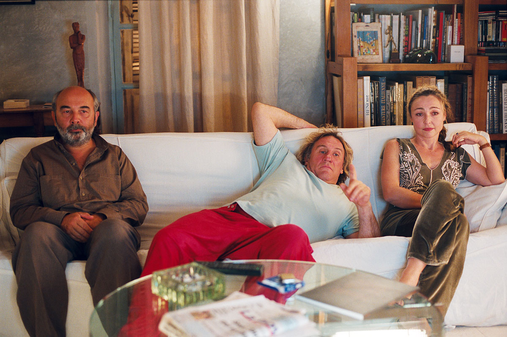
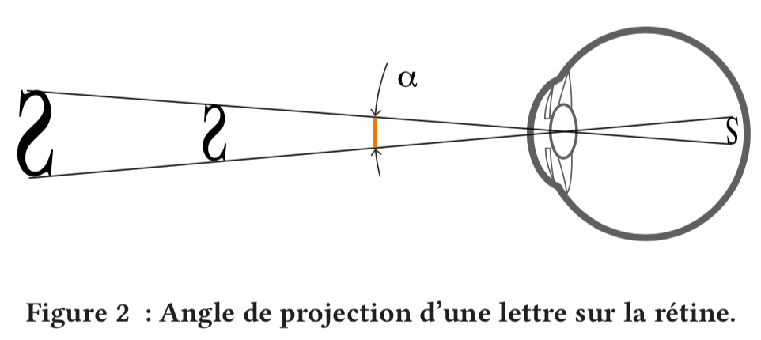
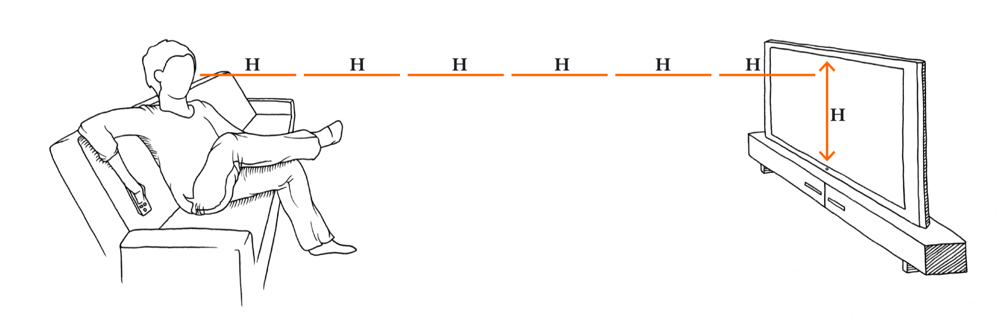
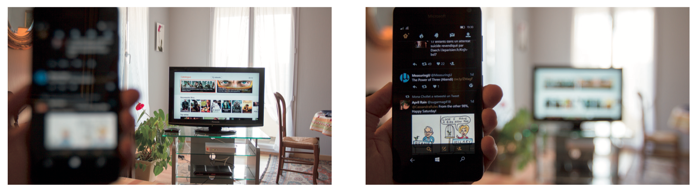
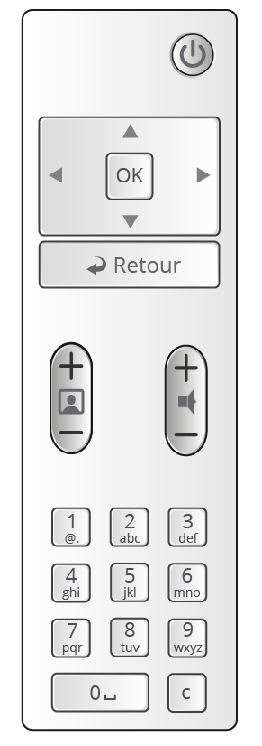
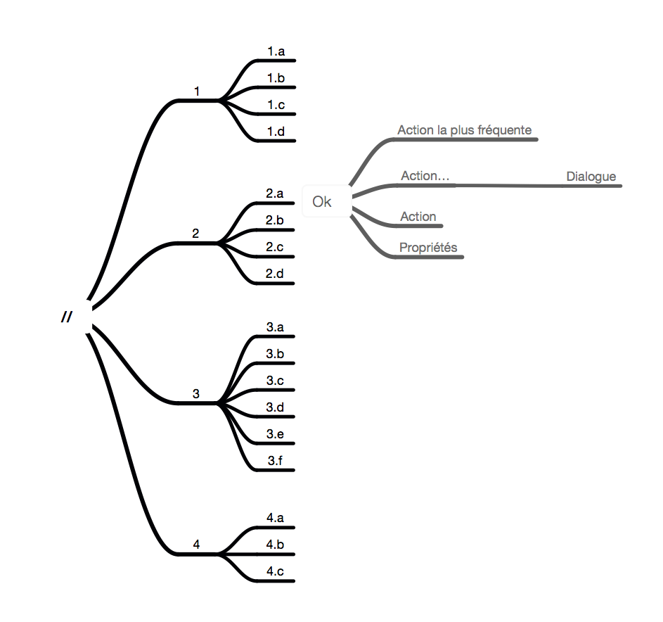
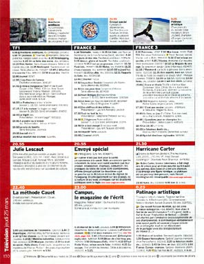
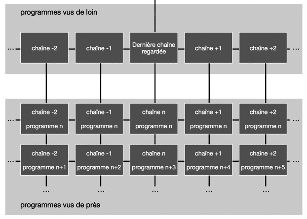
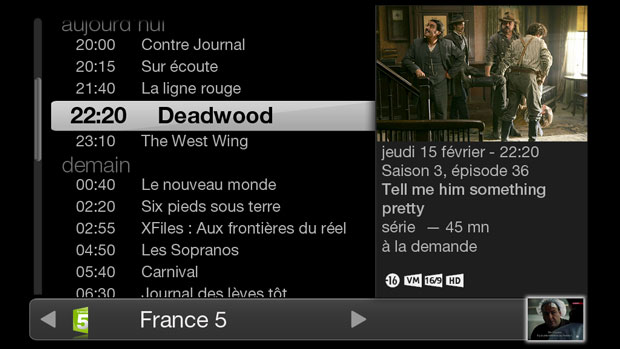

# Un exemple de projet
Je vous propose d’illustrer cette introduction par un projet réaliser en plusieurs temps mais qui permet dérouler les différentes étapes d’un processus UX. Ce projet concerne la télévision par internet chez un grand opérateur de téléphonie. L’avantage de ce sujet c’est que tout le monde a déjà utilisé une télévision mais vous n’avez probablement jamais fais vraiment attention aux interactions.  

## Le déroulement
 Les étapes d’un projet sont les suivantes :
- *La recherche utilisateur* : dans cette phase, le but est de construire les connaissances que l’on a sur les utilisateurs. Cette connaissance peut existé dans la littérature scientifique, mais il faut bien souvent la compléter par des observations sur le terrains.
- *La conception* : Il faut commencer à réfléchir, puis à rédiger ce à quoi va ressembler le produit ou le service. Cela peut aller de simples brouillons papiers à des prototypes avancées. Bien-sur la conception ne se fait d’un trait, elle va être itérative et se confronter régulièrement au utilisateur mais aussi aux autres métiers impliqués dans le projet.
- *La validation auprès des utilisateurs* : Il est nécessaire de confronter régulièrement la conception aux utilisateurs finaux afin de valider celle-ci et de faire évoluer le projet.
Gardez à l’esprit ces trois grandes étapes, il y a bien sur des variantes ou certains auteurs vont rajouter des étapes intermédiaires et le processus ne doit pas être linéaire mais bien itératif.

# Concevoir la télévision connectée

## Connaître les usages
Le projet a débuté vers 2008, avec les premiers éléments de conception. Il a fallut dans un premier temps comprendre les usages des utilisateurs devant la télévision. Pour ça une littérature scientifique existait sur le sujet avec par exemple : 
- Bernhaupt, R., Obrist, M., and Tscheligi, M. (2007). [Usability and usage of iTV services](https://www.researchgate.net/profile/Marianna_Obrist/publication/220686242_Usability_and_usage_of_iTV_services_Lessons_learned_in_an_Austrian_field_trial/links/02e7e51c0e3ef31c56000000/Usability-and-usage-of-iTV-services-Lessons-learned-in-an-Austrian-field-trial.pdf) : lessons learned in an Austrian field trial. ACM Computer Entertainment. Vol. 5. No. 2 Article 6.
- Brown, B., Barkhuus, L., [“The Television will be Revolutionized : Effects of PVRs and Filesharing on Television Watching”](http://delivery.acm.org/10.1145/1130000/1124870/p663-brown.pdf). Proceedings of CHI 2006, 663-666.
- Darnell, M. J. (2007). [How Do People Really Interact With TV? Naturalistic Observations of Digital TV and Digital Video Recorder Users](http://onemvweb.com/sources/ethnography/people_interact_tv.pdf). ACM – Computers in Entertainment, Vol. 5, Issue 2, Article No. 10.

	Si vous recherchez des articles scientifiques, il existe des bibliothèque en ligne comme https://dl.acm.org [dl.acm.org]. Une fois le résumé de l’article trouvé, une recherche sur le titre ou les auteurs permet souvent de trouver l’article en entier. Les auteurs publient fréquement leurs articles sur leurs sites professionels.

Il ressort de cette littérature que la situation d’usage se caractérise par les éléments suivants :
- Un usage collectif : L’usage de la télévision est essentiellement collectif notamment en début de soirée. La télévision reste un moment d’échange et ludique. Elle devient plus personnelle en fin de soirée. C’est une différence majeure avec l’ordinateur qui est lui très personnel. Cela signifie, par exemple, que les services nécessitant une certaine confidentialité (Un adolescent n’ira pas utiliser Facebook au milieu du salon.) ne seront pas utilisés sur la télévision.
- Une attention réduite, une attitude relâchée : L’utilisateur va avoir une attitude détendue devant la télévision. Son attention sera moindre, ainsi que son activité cognitive. Il prendra moins d’initiatives et se lassera plus facilement des tâches complexes. Tout problème d’ergonomie se soldera donc probablement par un abandon.
- Une utilisation routinière : Les utilisateurs devant la télévision ont des habitudes. Cette routine permet aussi de se relaxer.
- Un nombre de choix limité : Ils regardent régulièrement les mêmes chaînes à des moments similaires. Ils connaissent le numéro des chaînes qu’ils regardent, ainsi que le moyen de les atteindre rapidement.
- Une ambiance tamisée : La télévision est souvent regardée dans une pièce avec un éclairage réduit.

Ces usages peuvent croisées avec d’autres données comme les statistiques sur les temps d’utilisation des différents médias publié par Médiamétrie, ou des observations in-situ.

Globalement, le constat est fait d’un usage assez passif de la télévision. Il ne faudra donc pas envisager de fonctions complexes sur celle-ci, ou alors les déporter sur d’autres supports mieux adaptés.

## La taille des caractères
Une question qui c’est rapidement posée au début de la phase de conception, est de savoir de quelle taille devait être les textes présents sur la télévision. Ça peut paraître anodin au premier abord, mais en fait ça détermine la quantité d’informations que l’on peut afficher sur l’écran pour que celle-ci soit lisible par un utilisateur avachi dans son canapé. Donc en réalité la question est centrale pour toute la conception.

### L’angle de vue et la distance à la télévision
Comment procèdes t’on pour déterminer la taille des caractères ? Il faut déjà savoir qu’une norme, la norme ISO 9241-303, spécifie l’angle de vision d’un caractère pour qu’il soit lisible.

> « Les caractères latins doivent avoir une hauteur minimale de 16′ d’arc ; il faut que le système ait la capacité de fournir une hauteur de caractère de 20′ à 22′ d’arc. »

Pour calculer l’angle formé par l’œil de l’utilisateur avec la hauteur du caractère, en situation réelle, il va falloir connaitre la hauteur de la télévision et la distance entre l’utilisateur et sa télévision. Une fois que l’on a ces distances avec un peu de trigonométries et de statistiques, on pourra calculer la taille des caractères.

Pour synthétiser la méthodologie ça donne le processus suivant :
- La norme ISO donne l’angle de vision à respecter pour la lecture d’un caractère.
- Il faut connaitre l’angle de vision réel des télévisions chez les utilisateurs donc leurs demander la hauteur de leur télévision et la distance entre le canapé et la télévision.
- De là un calcul statistique permet de connaitre la distribution dans la population du rapport entre la hauteur de la télévision et la distance entre la télévision et l’utilisateur.
- Ça permet de calculer l’angle de vision de la télévision, et en fonction de la résolution de celle-ci de déterminer la taille des caractères.

Donc là, l’étape clef, c’est de demander aux utilisateurs de mesurer la hauteur de leur télévision et la distance télévision-canapé. Il faut faire un questionnaire et le faire remplir par une population représentative. La conception du formulaire doit permettre de s’assurer que l’utilisateur va bien comprendre la consigne et mesurer les bonnes distances. La diffusion n’est pas un problème pour un opérateur qui a une base de clients importante et représentative.

### Les résultats

![Distribution de l’effectif de l’échantillon en % selon la distance relative à la hauteur de l’image TV, avec un intervalle de confiance de 95 % autour des proportions. Clef de lecture : 24 % de l’échantillon a répondu regarder la télévision à une distance qui se trouve entre 5 et 6 hauteurs de l’image de leur TV ; On est sûr à 95 % qu’entre 21 % et 26 % des ménages TV+Internet français répondraient regarder la télévision à une distance située entre 5 et 6 hauteurs de l’image de leur TV ; 50 % de l’échantillon a répondu regarder leur TV depuis moins de 6 hauteurs.](images/Effectifs.png "Distribution de l’effectif de l’échantillon en % selon la distance relative à la hauteur de l’image TV.")

Les résultats de cette étude ont été publiés, dans sa version la plus récente en 2017 (Bertolus, 2017)[^1]. Ils montrent que pour une télévision HD 1080, si on veut que 70% de la population puisse lire facilement, sans se lever ou se pencher en avant, il faut écrire avec une taille de caractères entre 55 et 72 pixels. C’est bien supérieur à ce qui était recommandé par ailleurs par exemple chez Google. En termes de quantités d’informations qu’il est possible d’afficher sur la télévision, on est assez proche de la densité d’un téléphone mobile.

## La conception de l’IHM
En prenant en compte les usages et le contexte, on peut expliquer la phase suivante de conception de l’IHM[^2], Celle-ci se compose de la partie matériel notamment avec la télécommande et la partie numérique qui va s’afficher sur la télévision.

### La télécommande
Pour concevoir la télécommande, il a fallut combiner les usages des utilisateurs qui ont donnés lieu à une étude spécifique et les besoins fonctionnels. Il faut aussi prendre en compte que certaines de ces fonctionnalités sont très courantes, par exemple, naviguer dans des listes, que ça soit celle des chaînes ou des listes de vidéo à la demande. À l’inverse, certaines interactions sont connues pour être compliquées comme la saisie du texte, quelque soit le moyen utilisé, clavier « SMS » ou clavier virtuel.

Le choix a donc été fait d’une télécommande avec un nombre minimum de touches :
- Un pavé numérique pour saisir les numéros de chaînes, les codes confidentiels ou le texte en mode « SMS ».
- Un pavé directionnel avec une touche de validation et une touche de retour.
- Les touches pour régler le son et changer de chaînes
- La touche arret/marche

Il faut savoir que quand vous concevez ce type de dispositif physique, il va avoir une durée de vie très importante sur plusieurs années voir une dizaine, là où les interfaces numériques vont généralement  évoluer sur des cycles d’un à deux ans. On observe souvent des touches dédiées à des services spécifiques par exemple pour la VOD[^3], mais il est probable que d’ici 3 ou 4 ans après la commercialisation de la télécommande, le service est évolué, voir disparu ou simplement changé de nom ou de logo.

De plus, si vous laissez une touche orpheline, sans fonction, il est très probable que quelqu’un va lui attribuer une fonction pour son service et le voisin va lui attribuer un autre usage créant ainsi des incohérences et de la frustration chez les utilisateurs.

### Le choix du type d’interface

En parallèle des choix fait pour la télécommande, il faut poser les bases de l’interface sur la télévision. Pour cela, on n’invente pas quelque chose de nouveau, mais on s’appuie sur les connaissances existantes. À partir du contexte évoqué précédemment, il faut déterminer quel type d’interface permettra une prise en mains rapide pour un public très large de 2 ans à 122 ans. Il existe quatre grands types d’interfaces :
- Les interfaces hiérarchiques ; une arborescence permet d’accéder au contenu, par exemple des morceaux de musiques, et sur ces contenus, il est possible de faire des actions simples, « lire ».
- Les interfaces WIMP que l’ont retrouve sur les ordinateurs et les smartphones.
- Les interfaces textes, moins courante actuellement, mais c’était par exemple le cas du Minitel. On trouve encore dans les salles de marchés utilisées par les traders.
- Les interfaces en langages de commandes ; Elles nécessite de la part de l’utilisateur d’apprendre les commandes, mais une fois celle-ci maitrisée, ça peut être très efficient.
Les interfaces hiérarchiques sont donc celles qui conviennent le mieux pour la télévision.

L’interface va se présenter sous la forme d’une arborescence. Un écran d’accueil à la racine, permet de choisir parmi les différents services pour atteindre le contenu avec si besoin plusieurs niveaux. Une fois sur le contenu, la validation permet soit d’agir sur celui-ci avec si besoin un écran de dialogue : pour louer une VOD puis la lire, soit d’afficher des propriétés comme les sous-titres ou les informations.

Ces principes de bases sont en suite déclinés pour construire l’ensemble des éléments de l’interface, du menu principale aux cases à cocher en passant par la liste de chaînes ou les mosaïques des films. Ce qui abouti à un « guidelines de l’interface utilisateur », une charte ou un « design system ». Le terme évolue mais l’idée est la même, c’est d’avoir un ensemble de composants réutilisables afin de concevoir une interface facile à utiliser et à produire.

Une fois les grandes règles établies, on commence à décliner les services, ceux-ci vont aussi alimenter le guidelines si des besoins particulier apparaissent.

### Concevoir un service, le guide des programmes
 
Une étude de cas va permettre de comprendre le processus de conception d’un service sur la télévision. Ce service est la grille des programmes. La grille des programmes a pour but de présenter l’intégralité des programmes sur l’ensemble des chaînes, sur une période de temps donnée.

C’est un service courant mais qui est rarement abordé de manière satisfaisante. Et pour simplifier la problématique, il faut ajouter une contrainte supplémentaire, la présence des programmes en “TV à la demande” dans le passé et le futur !

#### La demande.
La demande s’exprimait simplement :
> Concevoir un “rétro” EPG (Guide des Programmes Electronique), sur 30 jours dans le passé, 15 dans le futur, pour l’ensemble des chaînes disponibles, faisant le lien avec le direct, le magnétoscope numérique et la TV à la demande

Dans les grandes lignes les paramètres à prendre en compte sont les suivants :
- Il y a environ 200 à 400 chaînes sur le “plan de numérotation”.
- Une chaîne présente 30 à 40 programmes par jour en moyenne. Dans le passé, tous les programmes ne sont pas disponibles, suivant les chaînes cela varie de 0 à 100 %. Suivant les chaînes, le nombre de programmes va varier de 450 (15 jours x 30) à 1 500 (30 jours x 30 + 15 jours x 40).
- Il faut prévoir les fonctions “voir la chaîne en direct”, “voir le programme” et “enregistrer”.
- Il faut prévoir une vue globale et une vue présentant le résumé du programme.
- Certaines chaines n’ont pas de programmes connus (Par exemple : Luxe TV), d’autres des programmes très long (Par exemple, BFM).

Le tout doit respecter les normes et les autres règles déjà définies précédemment. Il est aussi précisé que la solution existante, une simple grille, n’est pas satisfaisante.

#### L’étude préliminaire.
Avant d’attaquer la partie conception, il est intéressant s’interroger sur les usages et l’existant en matière de grilles des programmes.
 
*L’usage ?* Quel est l’usage de la grille des programmes sur la télévision ? L’utilisateur s’intéresse à la grille des programmes dans deux cas :
- Il a identifié un programme, il veut le retrouver pour le voir si c’est un programme en Tv à la demande ou simplement programmer l’enregistrement.
- L’utilisateur cherche un programme à regarder maintenant ou ce soir. Il se pose donc la question “Qu’est ce que je vais regarder ?”  et non “Qu’est ce qu’il y a à la Télé ?”. Dans le premier le cas, l’utilisateur va arrêter sa recherche après avoir identifié un ou deux programmes. Dans le deuxième cas, il devrait se faire une idée de l’ensemble de la grille.

Dans tous les cas l’utilisateur se construit une représentation mentale de la grille avec certains points clefs :
- Les programmes récurrents connus : Vendredi soir, France 3 ? Thalassa ; A 20h sur TF1 ? Journal
- Les programmes qu’il a identifiés, par exemple, en regardant un magazine TV.
- Les chaînes qu’il regarde : par exemple, Gulli, canal 18.

Gardez à l’esprit cette image d’un tableau avec certaines cases plus ou moins remplies.

La référence en matière de grille des programmes c’est les magazines TV. Ils présentent l’essentiel de la presse papiers avec 17 millions d’exemplaires hebdomadaire. L’organisation de ces grilles est relativement semblable.

Les chaînes sont affichées à l’horizontale, le temps à la verticale. L’espace est structuré en fonction de l’audience et de la récurrence.
- Le matin ou l’après-midi, l’audience est faible. Peu d’espace est consacré à ces programmes.
- En début de soirée, puis en deuxième partie de soirée l’audience est maximum. L’espace utilisé est important.
- Les programmes récurrents et connus, comme le journal de 20h, prennent peu d’espace.
- La grille est calée sur deux repères 13h et le début de soirée.

Sur la télévision, les chaînes, souvent 5 ou 6, sont affichées à la verticale, le temps à l’horizontale. Cette présentation à plusieurs défauts :
- La taille de la case d’un programme est fonction de sa durée. Pour les programmes courts, nombreux entre 18h et 21h, il n’y a pas la place de mettre le titre.
- La grille des programmes est découpée en une mosaïque de carrés de deux heures par six chaînes. La navigation se fait dans le carré puis en “sautant” de carré en carré. Si l’utilisateur veut balayer une chaîne ou une plage horaire, c’est dans les deux cas assez fastidieux.

#### La conception.
La grille des programmes peut être formalisée sous une forme graphique simple, quelques règles viennent compléter cela pour aboutir à un premier schéma d’interface. La navigation dans la grille est par contre un point complexe où deux solutions sont envisageables.

Une grille des programmes est donc un tableau, présentant des lignes (le temps) et des colonnes (les chaînes). L’utilisateur peu observer ce tableau de loin, au niveau global de la chaîne ou il peut zoomer et regarder au niveau du programme. Cela implique que les règles de navigations sont strictement identiques dans les deux vues car l’utilisateur est sur le même “objet”, la grille. A l’horizontal, l’utilisateur change de chaînes, à la verticale il navigue dans le temps.

La navigation est le point clef de la conception de cette grille des programmes. Elle pose différentes questions, notamment à cause de la présence des programmes disponibles dans le passé. Pour raisons de concision et d’action minimale, dans le passé, seul les programmes accessibles (en Tv à la demande ou enregistrés) sont affichés. La problématique est la suivante «Comment proposer une navigation cohérente permettant à l’utilisateur de garder ses repères dans la grille ?» sachant que  :
- La grille des programmes est irrégulière, tous les programmes n’ont pas la même durée et ne commence pas à la même heure.
- Elle est discontinue, notamment dans le passé, certaines plages horaires sont vides.
- Elle présente des cas particuliers : chaînes sans programmations, avec juste un libellé ou des cases horaires sans programmes ou très longues (plus de 3h).

Il faut déterminer quel est le comportement de l’interface lors de l’utilisation des touches droites/gauches et haut/bas pour naviguer dans la grille. La solution retenue est la suivante : 	
- Droite/gauche changement de chaînes.
- Haut/bas navigation dans le temps, changement de programme.
- L’heure de référence est celle du dernier programme sélectionné dans le temps (touches haut/bas). Ça évite de reculer dans le temps, ou d’être perdu si une chaîne présente des troues important dans sa grille.

#### La réalisation
Le service se compose en réalité d’un faible nombre d’écrans, même si les écrans peuvent contenir une quantité d’informations très variable en fonction des chaînes et des programmes. L’arborescence est la suivante :

*arborescence à faire*

Par défaut, l’utilisateur accède au service par l’écran de présentation par chaînes. Les écrans de présentation par chaînes et par programmes sont des écrans “primaires”. Ils contiennent les ou l’objet du service, en l’occurrence le programme. Sur ces écrans, La touche “Ok” permet d’afficher le menu de commande qui va présenter les actions possibles. Dans le cas présent, nous avons les commandes suivantes :
- “LA CHAÎNE en direct” : renvoi vers la télévision sur la chaîne.
- “Voir” : permet de visionner le programme soit enregistré, soit en Tv à la demande, dans le service dédié.
- “Résumé” ou “liste des programmes” : sur la présentation par chaînes cela permet d’accéder à la présentation par programmes et vice versa.
- “Enregistrer” : permet de programmer l’enregistrement dans un écran de dialogue “Enregistrer”.
- “Revenir à maintenant” : La grille des programmes pouvant être vaste, cette commande permet de se repositionner sur l’instant présent après une longue navigation.

Les écrans, enfin ! Le titre des programmes étant un élément important de choix, une part importante de l’écran est dédiée à la liste. Un effet de zoom permet une bonne lisibilité du titre sélectionné tout en conservant une liste suffisamment longue.

La télévision est toujours dans une petite vignette en bas à gauche, afin que l’utilisateur puisse utiliser le service pendant les publicités par exemple. Le son est aussi toujours présent.

Un programme enregistré se retrouve accessible même sur une chaîne ne disposant pas de “Tv à la demande”.

En appuyant sur « ok », le menu de commande vient s’afficher sur le contenu afin de garder le contexte. Les items suivis d’un “\>\>” quitte le service, ceux suivis de “…” ouvrent un dialogue.

La vue par programme présente le résumé. Les touches haut/bas permettent toujours d’afficher le programme précédent/suivant.

Le menu de commande  est similaire à celui de la présentation en liste. Les items non actifs peuvent être grisés. Le menu est alors permanent et stable.

Cette étude de cas montre le déroulement de la création d’un service dans un cadre déjà défini. Le résultat peut paraître simple, mais il faut bien comprendre qu’en réalité, c’est la mise en œuvre d’un processus complexe et long qui a permis d’aboutir à un tel résultat.

## Valider auprès des utilisateurs

iso 20282

Le but de ces méthodes d’évaluation est d’avoir des résultats qui soient prédictifs et donc généralisables à la population parente. Ces méthodes d’évaluation portent sur trois variables mesurables :
•	L’efficacité : réussite ou non de la tâche à effectuer (ex : retirer 20 € à distributeur de billet)
•	L’efficience : temps mis pour effectuer la tâche.
•	La satisfaction : une échelle de satisfaction de -2 à +2 en 5 niveaux.
Les résultats obtenus vont donc être de la forme :
•	Taux de succès de l’échantillon sur l’objectif est de 80 %. Le taux de succès minimal sur l’objectif inféré à la population mère est 70 %, avec une confiance de 80 %.
•	La durée moyenne de réalisation de l’objectif inférée à la population mère est entre 50 et 100 secondes avec une confiance 80 %.
•	La satisfaction globale est de 1,25.
Les résultats sont donc généralisables à la population parente dans une certaine mesure. Cela nécessite un nombre important de sujets, de l’ordre de 20 à 50. Plus le nombre de sujets est important, moindre est la différence entre les résultats obtenus et inférés, pour un même niveau de confiance.
Mais pour chaque sujet la passation est assez courte car il y a une ou plusieurs tâches à réaliser et c’est tout (pas de questionnaires, pas de verbatines,…).

[^1]:	La distance d’utilisation nécessite une taille de caractères élevée pour permettre la lisibilité sur le téléviseur, Bertolus, Bailleul, Mersiol, 2017. AFIHM. 29ème conférence francophone sur l'Interaction Homme-Machine, Aug 2017, Poitiers, France. ACM, IHM-2017, 10 p., 2017, http://ihm2017.afihm.org

[^2]:	Interface Humain Machine

[^3]:	Vidéo à la Demande