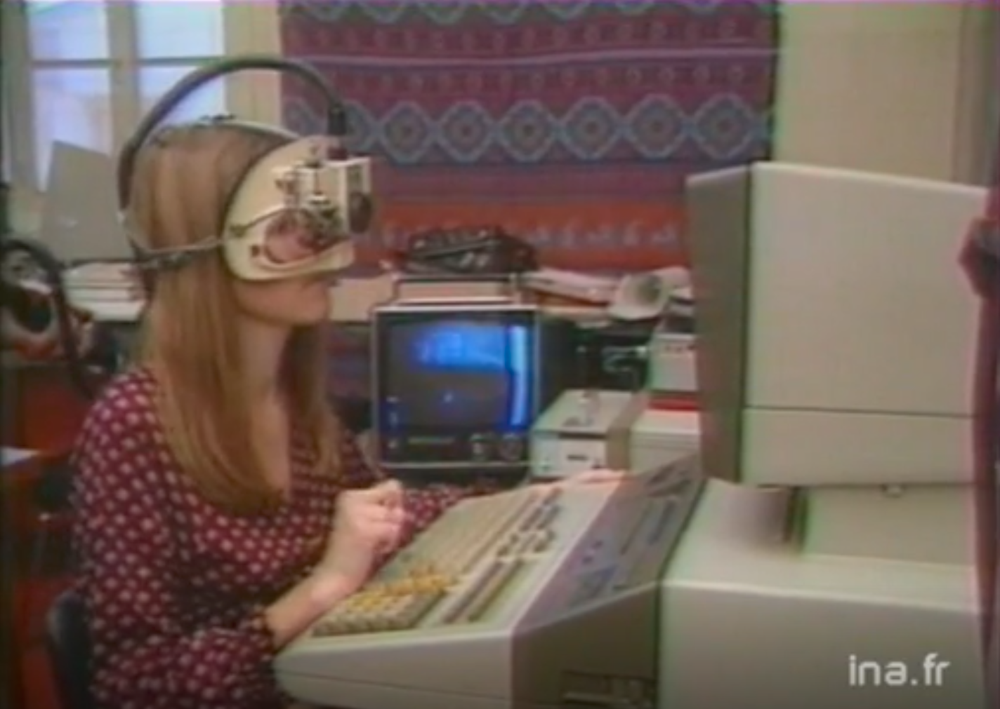

# Une petite histoire de l’UX

Le but de cette petite histoire est de vous donner les points clefs qui sont à l’origine de l’expérience utilisateur, sans pour autant faire un exposé sans fin sur les détails.

## La préhistoire informatique

L’expérience utilisateur est l’évolution d’autres disciplines qui sont apparues au cours du XXe siècle. Le premier tournant majeur fut la 2e guerre mondiale, durant laquelle il a été nécessaire de rationaliser et d’améliorer deux aspects : les postes de pilotages des avions et les radars. Pour les premiers, il était nécessaire que n’importe quel pilote puisse prendre en mains rapidement n’importe quels avions sans avoir à faire une formation longue. Avant guerre chaque constructeur d’avions organisait les divers affichages et commandes de pilotages comme bon lui semblait. À partir de là, les affichages et les commandes ont été en grande partie normalisés afin de facilité la prise en mains. Comme sur une voiture, vous étiez alors sûrs de retrouver les mêmes commandes aux mêmes endroits. La deuxième problématique était les radars, ou plus précisément l’attention constante que devaient porter les opérateurs aux signaux qu’affichaient ou non les radars. L’affichage étant relativement rustique, il a été nécessaire de comprendre comment éviter la lassitude des opérateurs afin qu’ils détectent toujours au plus tôt les attaques en approches.
Suite à la guerre, les personnes qui avaient travaillé sur ces problématiques, ce sont retrouver dans le civil que ce soient l’aviation ou l’industrie. Elles sont donc appliquées les mêmes méthodologies, de « [Human-factors engineering](https://www.britannica.com/topic/human-factors-engineering)[^1] », aux problématiques qu’elles rencontraient par exemple dans la conception de poste de contrôles de centrale nucléaire, d’usines ou de tours de contrôles.

## Les débuts de la micro-informatique

Il est aussi intéressant de revenir un peu en arrière et de regarder [cette vidéo proposer par l’INA](http://www.ina.fr/video/CAB8001676901/ergonomie-de-l-informatique-video.html) qui montre l’état de la recherche en ergonomie des IHM (Interface Humain Machine) en France dans les années 1980 lors d’un journal télévisé. On observe plusieurs éléments intéressants dans cette vidéo : 
Monsieur Spérandio évoque plusieurs technologies, les écrans plats apparus dans les années 2000, les écrans tactiles apparus avec les smartphones en 2007 avec l’iPhone ou un peu précédemment avec les Palm pilot, Enfin la reconnaissance vocale qui s’est démocratisé avec Siri puis avec les assistants vocaux. Ce qui est intéressant avec cette vidéo c’est qu’elle montre que les technologies qui émergent aujourd’hui après du grand public sont étudiées dans des laboratoires depuis près de quarante ans. L’expérience utilisateur se base sur des connaissances scientifiques qui évoluent constamment.

Dans les années 1970, c’est le virage de la micro-informatique, avec notamment le Xerox PARC. Xerox, vendeurs de photocopieurs, pensent que le papier va disparaître. Ils décident alors de fonder un centre de recherche qui à pour mission d’envisager l’avenir de l’informatique. Pour cela, ils engagent une équipe de jeunes chercheurs qui abordent le problème en s’appuyant sur les travaux des psychologues s'intéressant au développement de l’enfant : Jean Piaget et Jérôme Bruner. Bruner postule un modèle de développement basé sur une combinaison de capacités :
- de représentation (orientation spatiale, manipulation d’objets)
- « iconiques » (reconnaissance visuelle, comparaison)
- « symboliques » (comprendre des notions abstraites)

Le Xerox PARC s’oriente donc vers une interface représentant les objets à manipuler. Pour la manipulation, ils introduisent l’utilisation de la souris. La métaphore du bureau favorise la compréhension de l’ensemble. Les interfaces WIMP (Windows, Icônes, Menu, Pointing) sont nées. Quelques années plus tard, un certain Steve jobs va viendra visiter le Xerox PARC et en repartira avec quelques idées à mettre en œuvre dans ses projets, dont notamment le Mac. Pour la première fois une personne sans compétences en informatiques peut utiliser un ordinateur.

## La naissance de l’expérience utilisateur
Au cours des années 1990, La bataille des interfaces sur les ordinateurs de bureau est finie, Windows 95 a rejoint Mac OS avec des principes similaires. On voit apparaître les téléphones mobiles et les PDA (Personal Digital Assistants) comme les Palm Pilot. Internet se développe au cours de la décennie, d’abord sous la forme d’un réseau militaire puis universitaire, puis le web arrive avec [une première page publiée](http://info.cern.ch/hypertext/WWW/TheProject.html) par Tim Berners-Lee au CERN. Le web deviendra accessible au grand public à partir de 1996, 1997.

Du point de vue l’expérience utilisateur, ça signifie surtout que vous n’êtes plus captifs d’un seul support, d’un seul écran (papier ou logiciel), mais qu’il va falloir commencer à réfléchir à des expériences qui commencent peut-être en boutique puis continuent sur un autre support comme le web, ou des informations qui sont présentes sur votre ordinateur et synchronisées avec votre PDA quand vous êtes en déplacement.

## Les années 2000 et la multiplication des écrans
À partir de là le travail de l’UX designer va considérablement se complexifier. Au départ, il suffisait de concevoir un service pour ordinateur, ou pour le web. Puis le web mobile est arrivé d’abord très sommaire avec le WAP, mais dès 2007 avec l’arrivée de l’iPhone, il a fallu concevoir du « vrai » web pour des écrans de petites largeurs, ainsi que des applications mobiles. Ces petits écrans entraînent des contraintes fortes pour la conception avec des interactions tactiles qui ne sont pas forcément évidentes à comprendre au départ. Il suffit de regarder la présentation du premier iPhone par Steve Jobs, avec le recul on s’aperçoit qu’il est en train de former les journalistes et les personnes présentes dans la salle pour que ceux-ci puissent expliquer les gestes de base comme le zoom sur une carte.

Dans le même temps on a vu arriver les objets connectés. C’est un grand terme qui recouvre des choses bien différentes qui vont de la télévision par IP qui nécessite une box et l’IHM qui va avec, aux montres sportives intégrant GPS et cardiofréquencemètres. Là, la difficulté est qu’il faut tout concevoir de A à Z. Sur un iPhone, Apple fourni un Guideline de l’interface utilisateur (Ou Google pour Android) qui vous indique comment concevoir l’interaction. Sur un objet connecté, il faut souvent tout construire depuis le matériel jusqu’aux interfaces.

Au final un même service pourra être dispersé sur 2 ou 3 interfaces différentes, combiné avec des points de contacts physiques mais il faudra maintenir une cohérence sur l’ensemble de l’expérience.

# À retenir
- L’expérience utilisateur est une discipline qui peut paraître récente dans sa forme actuelle, mais qui s’appuie sur des disciplines proches qui existent depuis près d’un siècle pour certaines.
- Il existe une recherche scientifique sur l’ensemble de ces sujets. Le temps entre les premières recherches et la disponibilité auprès du grand public se compte souvent en dizaine d’année.
- Depuis me début du millénaire, les domaines d’applications de l’expérience utilisateur se sont fortement diversifiés et complexifiés.

Pour compléter, vous pouvez écouter [ce podcast de France culture](https://www.franceculture.fr/emissions/place-de-la-toile/petite-histoire-de-linteraction-homme-machine) interrogeant Nicolas Russel sur l’histoire de l’IHM : [https://www.franceculture.fr/emissions/place-de-la-toile/petite-histoire-de-linteraction-homme-machine](https://www.franceculture.fr/emissions/place-de-la-toile/petite-histoire-de-linteraction-homme-machine)

[^1]:	https://www.britannica.com/topic/human-factors-engineering